# Final Report - Monodepth #

> Author - {Ejup Hoxha, Stanislav Sotnikov, Santosh Suwal}

Monocular depth estimation is a novel problem in computer vision mainly applicable 
in areas of robotics, autonomous driving, and medical imaging.
The problem consists of predicting Depth (3D information) given a single view 2D RGB camera image.

## Abstract ##

Approximating depth of a 2D Red-Blue-Green (RGB) image is an effortless task for humans, 
as we utilize stereopsis and cues such as size, motion, texture, and linear perspectives [1]. 
Depth estimation in computer vison is a much more challenging task and plays 
a fundamental role in understanding 3D scene geometry, robotics, augmented reality, and medical imaging [2, 3]. 
The traditional approach is to utilise a multi-view method of stereo correspondence 
and temporal information from local motion signals [4, 5]. In spite of a high accuracy, 
its drawbacks include high costs of technology, extensive calibration and post-processing procedures. [6, 7, 8, 9].

Recently, more focus has been on Monocular Depth Estimation (MDE), 
where deep learning models, mostly Convolutional Neural Networks (CNN), 
are trained on RGB images and, depending on the level of supervision, the corresponding depths. 
These models work by analysing a horizon line, shades, hierarchical features, and other image-level information,
but still struggle with properties like object occlusion, 
repetitive patterns, and reflective or texture-less regions [10, 11]. 
The underlying issue causing this is called non-uniqueness or ambiguity as seen in *Figure 1*
and observed across all sciences, where a variety of bodies can produce an identical signal [12, 13]. 

*Figure 1. A line drawing on x-y axes without shades or shadows can only provide contour information (A). 
While people may try to reconstruct the original object (B), 
that is not always possible as many 3D scenes and objects correspond to an identical 2D projection (C).*

As part of this project Stanislav, Ejup, and Santosh have experimented with various well-known CNN architectures
to estimate depth maps from RGB camera images. Each distinct network architecture was trained on the same data to
achieve a degree of consistency when evaluating performance. Then, the selected network architectures were
evaluated on different datasets, which were not part of the original training set. During this process,
we observed that the models trained on the dataset representing a particular environment (ie interior images)
performed well when evaluated on different datasets representing a similar environment -- for instance, interior
images of apartments and interior images of offices; however, not as well, when evaluated on datasets containing
significantly different environment (ie indoor vs outdoor).

## Background ##

Traditional methods of estimating depth are categorised either as active or as passive methods
and rely on having information of the scene. The information of the scene needed to measure the depth 
can be extracted from space, as described by Baker et al., who worked on and described existing 
stereo correspondence algorithms for disparity spaces, or from time as in structure from motion, 
seen in Luo et al. work on camera-projector pixel correspondence [16, 17]. 
Active methods require a signal of a known wavelength to be injected into the environment 
and then measure the time it takes for it to arrive to the image sensor. 
This is called Time-of-Flight and can use ultrasound or lidar. 
Passive methods depend on computational image processing as in our case with MDE or multi-view geometry. 
The latter are known especially for their computational complexity [18].

Neural networks, which are the backbone for all deep-learning methods are categorised as supervised, 
self-supervised, and semi-supervised. In the case of supervised learning, 
training is done on a single 2D image and its corresponding depth and is the most popular. 
From the three deep-learning methods, this requires the most and the highest quality data, 
which is not always accessible. Some successful examples include Ibraheem et al., who used a 
standard encoder-decoder network on pretrained ImageNet and DenseNet-169 for feature identification [19, 20, 21]. 
Their network was trained on channel and plane swapping. 
The issue of depth estimation in videos was assessed by Teed and the team, who proposed a method DeepV2D 
for both, depth estimation and motion recognition [22]. 
They tried introducing a variety of features by using KITTI, NYU-v2, and other challenging datasets [23, 24]. 

Self-supervised networks function by finding dense correspondences and other geometry-based cues in a 
calibrated stereo pair but suffer from a limited set of scenarios from the training process. 
Tosi et al. used monocular residual matching called monoResMatch and taught it based on a true input 
image and synthesised features in that image from a different point of view [25]. 
Andraghetti et al. created densified depth maps 256x512 from 3D points and sparse depth maps [26]. 
Semi-supervised methods are in between the two extremes, 
as they require smaller datasets but also suffer from biases. In 2019 Zhao et al. 
proposed a geometry-aware symmetric domain adaptation framework (GASDA). 
It utilises symmetric style image translation and MDE of a synthetic dataset pulled from natural images, 
and in turn creates depth maps with 192x640 resolution [27].
As a result of the development of the depth dimension, the need for tools that would be able to handle 
three-dimensional data emerged. In 2011, an open project called Point Cloud Library (PCL) 
was created as a reference library containing many algorithms for point cloud processing, 
filtering, segmentation and more [28]. Point clouds are rarely used on their own and usually processed 
to retrieve implicit information. Qi and his team at Stanford University created PointNet, 
which provided a unified architecture for obtaining object classifications, 
part and sematic segmentation, and paved the way for further learning from point clouds [29]. 
Jiang, Wu, and Lu proposed a novel PointSIFT module that can be integrated into 
PointNet-like architectures and has an advanced semantic segmentation of objects 
at various scales and orientations [30].

#### A word on SLAM ####

The most popular uses of the depth estimation techniques are attributed to SLAM algorithms.
Simultaneous Localization And Mapping (SLAM) is the computational problem of constructing a map of
an unknown environment, while simultaneously keeping track of an agent's location within it [31].
SLAM problems can be categorized as Online SLAM, which tries to estimate the most recent pose of the agent,
and Full/Offline SLAM, which approximates the path that the agent has travelled. Hence,
to represent this in probabilistic terms, Online SLAM represents the distribution of a pose at time t on a map,
given the observations and the controls.
Instead of calculating the current pose, Full or Offline SLAM recalculates the entire trip [31].
In terms of the algorithm, SLAM problems can be solved using
Extended Kalman Filter (EKF), graph, or deep learning SLAM. EKF SLAM
is the earliest and most influential algorithm for Online SLAM and
uses maximum likelihood data association. Maps generated this way are feature-based,
but often use artificial features as feature detectors can be computationally expensive.
The algorithm relies on the assumption that the noise of the system is of the Gaussian form and non-linear
models are linearized to suit it.
Castellanos et al., Huang and Dissanayake, and Julier and Uhlmann showed that eventual
inconsistency related to non-linearity is inevitable,
but the efficacy is still a focus of many researchers [32, 33, 34].
Graph SLAM on the other hand solves the problem of Full SLAM.
It considers the constraints of the initial state of the autonomous vehicles and the map, the relative motion, and the relative measurements [31]. The name is coming from the fact that it is constructed as a graph problem, where each of the constraints mentioned represents an edge of the graph and each pose of the robot and landmark represents a vertex.
Finally, in recent years many researchers started using deep learning techniques to help improve SLAM.
Deep learning has been shown to be extremely useful for depth estimation, feature description, feature matching and extraction. Most of these innovative approaches are part of Graph SLAM, which help with increasing the accuracy of localization and mapping [35].
Visual SLAM or V-SLAM has emerged as a solution to the localization and mapping issue with the use a standard camera. It can be categorized as sparse and dense based on how maps are generated; or direct and indirect based on whether it extracts features or recovers 3D information using optimization methods. Well-known feature extractors include SIFT, FAST, and ORB, and the latter was famously used in ORB-SLAM and its later versions [36, 37, 38, 39].

## Data ##

We have utilized four different datasets in our overview of the Monocular Depth Estimation.
The data consists of RGB camera images and the corresponding depth maps acquired in various environments.
Each dataset is consistent per the environment where the images were taken. More on each set below.

#### [NYU v2](https://cs.nyu.edu/~silberman/datasets/nyu_depth_v2.html) ####

Our default choice for training. Very popular among the related works, therefore we chose NYU v2
as the dataset for training. The data is already split into training and test sets by the authors.
The training set contains approximately 50 000 640x460 8-bit color and 16 bit depth images. 
The environment consists of predominantly indoor NYC-like apartment images taken with 
RGB + Depth (RGB-D) camera system. NYU v2 contains clean data with consistent image resolutions. 

#### [DIML](https://dimlrgbd.github.io) Indoor and Outdoor ####

Digital Image Media Lab's large scale indoor and outdoor datasets contain
200 sequences each, such as library, classroom, laboratory, park, sidewalk, highway, etc...
Each RGB image is paired with a post-processed 8bit depth map acquired with RGB+D 
camera systems -- Kinect v2 for indoor and Zed for the outdoor scenes.
Image resolutions are 1344x756 for indoor and 1920×1080 for outdoor images.

#### [Middlebury](https://vision.middlebury.edu/stereo/data/) ####

Middlebury set consists of 33 different scenes acquired with a stereo camera.
The scenery mainly consists of pictures of different still objects in contrast to
the indoor-outdoor environments presented in the other datasets of this project.
Middlebury set does not offer the vanilla depth map, unlike the other sets, it contains a
pre-computed stereo disparity maps (left and right) to accompany each RGB stereo pair.
Each scene in this set contains images of different resolutions and aspect ratios.

#### Preprocessing ####

The main and the only step related to the data wrangling is to make sure both RGB image 
and the corresponding depth pair are properly fit to the input and output of 
an appropriate model. This step consisted of cropping the largest centered rectangle of the
appropriate aspect ratio within the given image pair; then, this rectangle is down-sampled
to fit the neural network's input and output.

## Methods ##

The goal of this work is that given an image, we can learn a function that will predict pixel-level depth map 
for any given environment. Although, innovative approaches seen in MonoDepth2 and D3VO treat this as an 
unsupervised or semi-supervised learning problem and are quite successful,
we decided to tackle this with more common supervised Convolutional perspectives [40, 41].
Here we make a conjecture that the aforementioned sequences of images
contain enough information about the depth to train our networks.

#### One Loss Function ####

We observed that none of the networks trained during this project would not work without
the key ingredient to depth estimation -- structural similarity loss.
All models presented further in this report use a combined loss function to measure the similarity
between two given depth images. This combined loss function consist of the weighted sum of
Structure Similarity Index Measure (SSIM) and Mean Squared Error (MSE). 
The use of SSIM allegedly captures the differences between shapes and edges,
while MSE helps capture the general structural differences between the two images.

#### Network Architecture ####

Over the course of the project we have experimented with four CNN encoder-decoder architectures,
each comprising a different encoder and similar decoder structure. Arguably, the encoder is mainly responsible
for extracting valuable features from the training image set, and the decoder is more peripheral to the task of
upsampling the encoded features. The decoder part consisted of either bilinear upsampling combined with vanilla
convolutional layers (Conv2D) or transposed convolutional layers (Conv2DTranspose). 
A few words on encoder architectures below.

#### ResNet50 ####

Residual Network where each batch of convolutional layers has a skip connection to the 
following batch of convolutional layers.

  
*Figure 2. ResNet*

#### DenseNet169 ####

DenseNet provides even more connection that ResNet, where each batch of convolutional layers has a skip connection 
to each following batch of convolutional layers.

  
*Figure 3. ResNet*

#### MobileNet ####

MobileNet is distinguished by a mixture of depth-wise and point-wise convolutions following one another. One of the main difference among with this network is it uses SeparableConv2D in it's decoder enabling to use resources better and produce better performance on low power devices.

  
*Figure 4. MobileNet*

#### UNet ####

  
*Figure 5. UNet*

## Evaluation ##

Each network presented above was evaluated based on a batch of 111 images from NUY-v2, DIML Indoor and Outdoor 
datasets, and 17 Middlebury images. Z-score normalization was applied to both predictions and ground truth.
Then, Mean Squared Error computed between the normalized prediction and ground truth batches.

We also considered min-max normalization to make the metrics comparable across different 
To elaborate on the issue regarding the choice of proper normalization method to be used across different datasets,
consider the following example. Assume two different depth sensors drawing a depth map of the same view, where
part of the view is occluded by an object in the middle. Also, assume both cameras register some pixels as infinity
(further than the maximum sensing range) and label these pixels as 255. Furthermore, these cameras
have different sensing ranges, which means that if one camera assigns value 100 as the distance to the occluding
object, say the other camera would assign "200". Now, we apply min-max normalization to these two depth images and 
calculate the Mean Square Error. We would expect the error to approach zero -- as both images are de facto considered
ground truth; however, this is not the case with our example, as there is a known constant offset between the two
images. Standardization should mitigate this issue by forcing both images to have a mean around zero.

Some of the results and metrics are presented below. Notice how on the image with a human from DIML Outdoor set,
only DenseNet was able to make a fair depth prediction.

#### ResNet50 ####

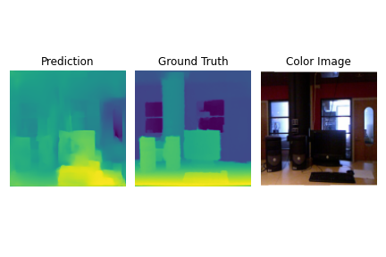  
*Figure 6. ResNet50 sample NYU-v2.*

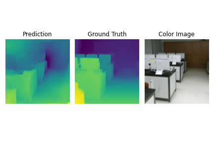  
*Figure 7. ResNet50 sample DIML Indoor.*

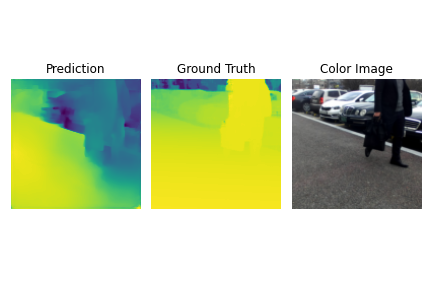  
*Figure 8. ResNet50 sample DIML Outdoor.*

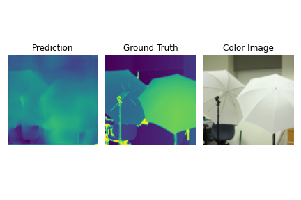  
*Figure 9. ResNet50 sample Middleburry.*

  
*Figure 10. ResNet50 Metrics.*

#### DenseNet169 ####

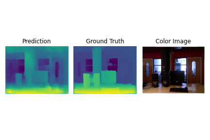  
*Figure 11. DenseNet169 sample NYU-v2.*

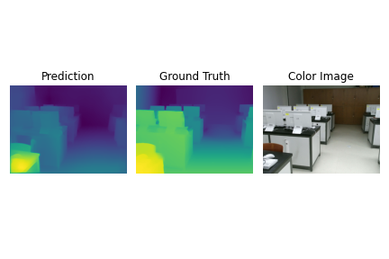  
*Figure 12. DenseNet169 sample DIML Indoor.*

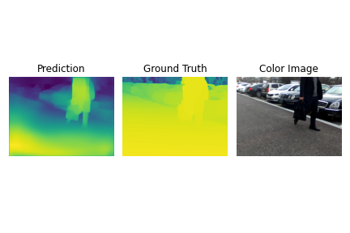  
*Figure 13. DenseNet169 sample DIML Outdoor.*

  
*Figure 14. DenseNet169 sample Middleburry.*

  
*Figure 15. DenseNet169 Metrics.*

#### MobileNet ####

  
*Figure 16. MobileNet sample NYU-v2.*

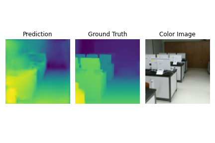  
*Figure 17. MobileNet sample DIML Indoor.*

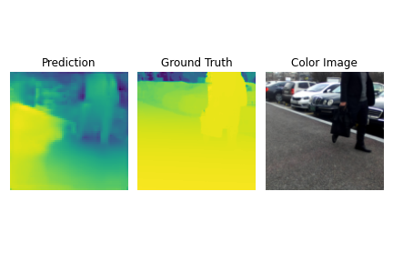  
*Figure 18. MobileNet sample DIML Outdoor.*

  
*Figure 19. MobileNet sample Middleburry.*

  
*Figure 20. MobileNet Metrics.*

#### UNet ####

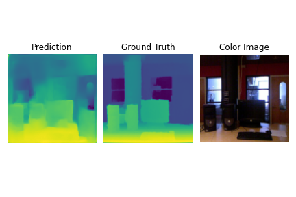  
*Figure 21. UNet sample NYU-v2.*

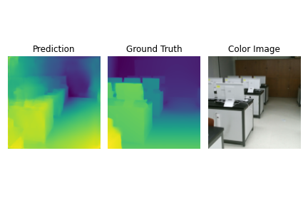  
*Figure 22. UNet sample DIML Indoor.*

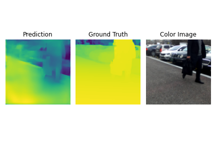  
*Figure 23. UNet sample DIML Outdoor.*

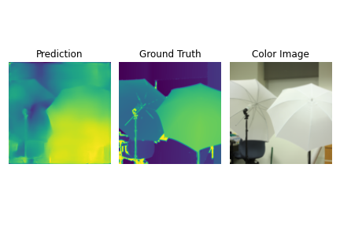  
*Figure 24. UNet sample Middleburry.*

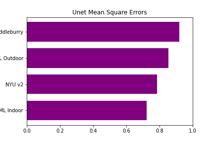  
*Figure 25. UNet Metrics.*

#### Metrics Summary ####

  
*Figure 26. Metrics Summary.*

## Conclusion ##

Over the course of experimenting with various CNN architectures to estimate depth maps from RGB camera images,
we noticed a few things:

 - CNNs tend to remember the objects from the environments they are trained in. For instance, the depth estimation
    model will fail to come up with a satisfactory depth prediction of an image containing a cat if the training
    data does not contain cats. This can be seen from looking at predictions from the middlebury set -- most of the
    scenery is indoors; however, very few images/objects get a decent depth map prediction. DenseNet being
   able to do well on the image with a human (Figure 8) is an exception.
   
 - CNNs tend to remember not just the objects, but the patterns of edges from the datasets they were trained on. This 
    conjecture explains the fact that because all the nets were trained on an indoor dataset (NYU v2) failed to do 
   reasonable well on images containing trees from the DIML Outdoor set, though not without some exceptions.
     
 - What do the metrics really mean? The before mentioned metrics of satisfactory and decent in this context are not 
   related to the quantitative error, rather to the judgement of a human observer. Though, by looking at the MSE plots, 
   we can visually check that Middlebury predictions are indeed worse than DIML Indoor predictions, but looking at the
   number of MSE itself virtually does not give any useful information.
   
 - Surprisingly ResNet and MobileNet showed better MSE score on the DIML Indoor, even though all the models were trained
    on NYU-v2. This could point towards the skewness of the evaluation data, as running the evaluation on the entire
   testing set was omitted due to the limited computational power and time.

## Attributions ##

## Bibliography ##
[1] Gardner, Jonathan S, et al. “Vertical Position as a Cue to Pictorial Depth: Height in the Picture Plane versus Distance to the Horizon.” Attention, Perception & Psychophysics, U.S. National Library of Medicine, Feb. 2010, www.ncbi.nlm.nih.gov/pubmed/20139458.

[2] Gupta, A., et al. “From 3D Scene Geometry to Human Workspace.” From 3D Scene Geometry to Human Workspace | Proceedings of the 2011 IEEE Conference on Computer Vision and Pattern Recognition, 1 June 2011, dl.acm.org/doi/10.1109/CVPR.2011.5995448.

[3] Liu, X., et al. “Dense Depth Estimation in Monocular Endoscopy With Self-Supervised Learning Methods.” IEEE Transactions on Medical Imaging, U.S. National Library of Medicine, 1 Nov. 2019, pubmed.ncbi.nlm.nih.gov/31689184/.

[4] Scharstein, Daniel, and Richard Szeliski. “A Taxonomy and Evaluation of Dense Two-Frame Stereo Correspondence Algorithms.” International Journal of Computer Vision 47, 7-42, Kluwer Academic Publishers, 2002, link.springer.com/article/10.1023/A:1014573219977.

[5] Y. Dai, H. Li and M. He, "Projective Multiview Structure and Motion from Element-Wise Factorization," in IEEE Transactions on Pattern Analysis and Machine Intelligence, vol. 35, no. 9, pp. 2238-2251, Sept. 2013, doi: 10.1109/TPAMI.2013.20.

[6] Shah, I., et al. “An Overview of Robot-Sensor Calibration Methods for Evaluation of Perception Systems.” NIST, 2012, www.nist.gov/publications/overview-robot-sensor-calibration-methods-evaluation-perception-systems.

[7] Chen, E. C. S.,et al. "Hand–eye calibration using a target registration error model", vol. 4, no. 5, pp. 157-162, 2017.

[8] Zhang, Zhengyou. “A Flexible New Technique for Camera Calibration.” IEEE Transactions on Pattern Analysis and Machine Intelligence, 1 Nov. 2000, dl.acm.org/doi/10.1109/34.888718.

[9] H. Javidnia and P. Corcoran, "A Depth Map Post-Processing Approach Based on Adaptive Random Walk With Restart," in IEEE Access, vol. 4, pp. 5509-5519, 2016, doi: 10.1109/ACCESS.2016.2603220.

[10] T. Van Dijk and G. De Croon, "How Do Neural Networks See Depth in Single Images?," 2019 IEEE/CVF International Conference on Computer Vision (ICCV), 2019, pp. 2183-2191, doi: 10.1109/ICCV.2019.00227.

[11] R. Ranftl, K. Lasinger, D. Hafner, K. Schindler and V. Koltun, "Towards Robust Monocular Depth Estimation: Mixing Datasets for Zero-shot Cross-dataset Transfer," in IEEE Transactions on Pattern Analysis and Machine Intelligence, doi: 10.1109/TPAMI.2020.3019967.

[12] Hoover, Donald & Klein, Douglas & Campbell, David. GEOPHYSICAL METHODS IN EXPLORATION AND MINERAL ENVIRONMENTAL INVESTIGATIONS. USGS. 1995.

[13] Brooks, Michael & Chojnacki, Wojciech & Kozera, Ryszard. Circularly Symmetric E i ko rial Equations and Non-uniqueness in Computer Vision. Journal of Mathematical Analysis and Applications. 1992. 165. 10.1016/0022-247X(92)90075-O.

[14] Oliveira, Miguel, et al. “3D Object Perception and Perceptual Learning in the RACE Project.” Robotics and Autonomous Systems, vol. 75, 2016, doi:10.1016/j.robot.2015.09.019.

[15] Mocanu, Decebal Constantin, et al. “Estimating 3D Trajectories from 2D Projections via Disjunctive Factored Four-Way Conditional Restricted Boltzmann Machines.” Pattern Recognition, Pergamon, 29 Apr. 2017, www.sciencedirect.com/science/article/pii/S003132031730167X.

[16] Baker, Simon, et al. “A Database and Evaluation Methodology for Optical Flow.” Springer, 2011, doi:10.1007/s11263-010-0390-2.

[17] Huafen Luo, Jing Xu, Nguyen Hoa Binh, Shuntao Liu, Chi Zhang, Ken Chen, A simple calibration procedure for structured light system, Optics and Lasers in Engineering, Volume 57, 2014, Pages 6-12, ISSN 0143-8166, https://doi.org/10.1016/j.optlaseng.2014.01.010.

[18] Khan F., Salahuddin, S., Javidnia, H., “Deep Learning-Based Monocular Depth Estimation Methods-A State-of-the-Art Review.” Sensors (Basel, Switzerland), U.S. National Library of Medicine, Apr. 2020, pubmed.ncbi.nlm.nih.gov/32316336/.

[19] Alhashim, Ibraheem, and Peter Wonka. “High Quality Monocular Depth Estimation via Transfer Learning.” ArXiv.org, 10 Mar. 2019, arxiv.org/abs/1812.11941.

[20] Huang, Z. Liu, L. van der Maaten, and K. Q. Weinberger. Densely connected convolutional networks. 2017 IEEE Conference on Computer Vision and Pattern Recognition (CVPR), pages 2261–2269, 2017.

[21] J. Deng, W. Dong, R. Socher, L.-J. Li, K. Li, and L. Fei-Fei. “Imagenet: A large-scale hierarchical image database.” 2009 IEEE Conference on Computer Vision and Pattern Recognition, pages 248–255, 2009.

[22] Teed, Z.; Deng, J. “Deepv2d: Video to depth with differentiable structure from motion.” arXiv Prepr. 2018, arXiv:1812.04605

[23] Geiger, A.; Lenz, P.; Urtasun, R. “Are we ready for autonomous driving? The KITTI vision benchmark suite.” In Proceedings of the 2012 IEEE Conference on Computer Vision and Pattern Recognition,  2012; pp. 3354–3361

[24] Silberman N., Hoiem D., Kohli P., Fergus R. (2012) Indoor Segmentation and Support Inference from RGBD Images. In: Fitzgibbon A., Lazebnik S., Perona P., Sato Y., Schmid C. (eds) Computer Vision – ECCV 2012. ECCV 2012.

[25] Tosi, Fabio, et al. “Learning Monocular Depth Estimation Infusing Traditional Stereo Knowledge.” ArXiv.org, 8 Apr. 2019, arxiv.org/abs/1904.04144.

[26] Andraghetti, Lorenzo, et al. “Enhancing Self-Supervised Monocular Depth Estimationwith Traditional Visual Odometry.” ArXiv.org, 8 Aug. 2019, arxiv.org/abs/1908.03127v1.

[27] Zhao, Shanshan, et al. “Geometry-Aware Symmetric Domain Adaptation for Monocular Depth Estimation.” ArXiv.org, 3 Apr. 2019, arxiv.org/abs/1904.01870.

[28] Matteo Munaro, Radu B. Rusu, Emanuele Menegatti, 3D robot perception with Point Cloud Library, Robotics and Autonomous Systems, Volume 78, 2016, Pages 97-99, ISSN 0921-8890, https://doi.org/10.1016/j.robot.2015.12.008.

[29] C. R. Qi, H. Su, K. Mo, and L. J. Guibas. Pointnet: Deep learning on point sets for 3d classification and segmentation. In CVPR, 2017

[30] Jiang, Mingyang, et al. “PointSIFT: A SIFT-like Network Module for 3D Point Cloud Semantic Segmentation.” ArXiv.org, 24 Nov. 2018, arxiv.org/abs/1807.00652.

[31] Probabilistic Robotics by Sebastian Thrun, Wolfram Burgard and Dieter Fox, MIT Press, 647 Pp., ISBN 0-262-20162-3

[32] J.A. Castellanos, J. Neira, and J.D. Tardos. Limits to the consistency ´ of EKF-based SLAM. In IFAC Symposium on Intelligent Autonomous Vehicles, 2004.

[33] Huang, S, and G Dissanayake. “Convergence and Consistency Analysis for Extended Kalman Filter Based SLAM.” IEEE Xplore, 2006, ieeexplore.ieee.org/document/4339532.

[34] S.J. Julier and J.K. Uhlmann. A counter example to the theory of simultaneous localization and map building. In IEEE International Conference on Robotics and Automation, pages 4238–4243, 2001.

[35] G. Grisetti, R. Kümmerle, C. Stachniss and W. Burgard, "A Tutorial on Graph-Based SLAM," in IEEE Intelligent Transportation Systems Magazine, vol. 2, no. 4, pp. 31-43, winter 2010, doi: 10.1109/MITS.2010.939925.

[36] Canlin Li, Lizhuang Ma, A new framework for feature descriptor based on SIFT, Pattern Recognition Letters, Volume 30, Issue 5, 2009,Pages 544-557, ISSN 0167-8655, https://doi.org/10.1016/j.patrec.2008.12.004.

[37] E. Rublee, V. Rabaud, K. Konolige and G. Bradski, "ORB: An efficient alternative to SIFT or SURF," 2011 International Conference on Computer Vision, 2011, pp. 2564-2571, doi: 10.1109/ICCV.2011.6126544.

[38] Viswanathan, Deepak. “Features from Accelerated Segment Test ( FAST ).” 2011.

[39] Raúl Mur-Artal and Juan D. Tardós. ‘ORB-SLAM2: an Open-Source SLAMSystem for Monocular, Stereo and RGB-D Cameras’. In:IEEE Transactions onRobotics33.5 (2017), pp. 1255–1262.

[40] C. Godard, O. M. Aodha, M. Firman and G. Brostow, "Digging Into Self-Supervised Monocular Depth Estimation," 2019 IEEE/CVF International Conference on Computer Vision (ICCV), 2019, pp. 3827-3837, doi: 10.1109/ICCV.2019.00393.

[41] Jia , Qizeng, et al. “D 2VO: Monocular Deep Direct Visual Odometry.” Intelligent Robots and Systems, Oct. 2020, pp. 10158–10165.

[42] DIML/CVL RGB-D technical_report : This material is presented to provide a detailed description about the DIML/CVl RGB-D dataset.

[43] “TensorFlow, An end-to-end open source machine learning platform.” TensorFlow, https://www.tensorflow.org/datasets.

[44] Keras-Team. “Keras-Team/Keras.” GitHub, github.com/keras-team/keras.
